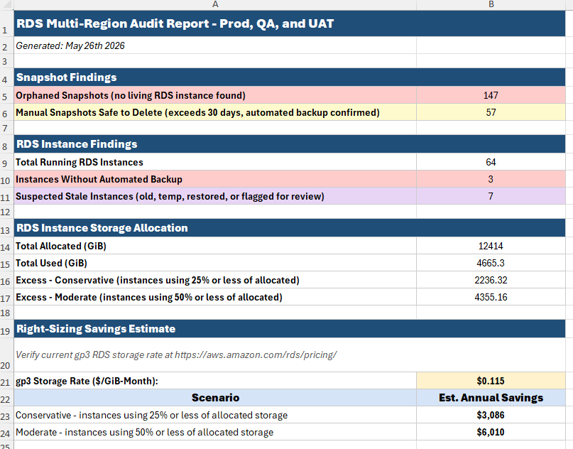
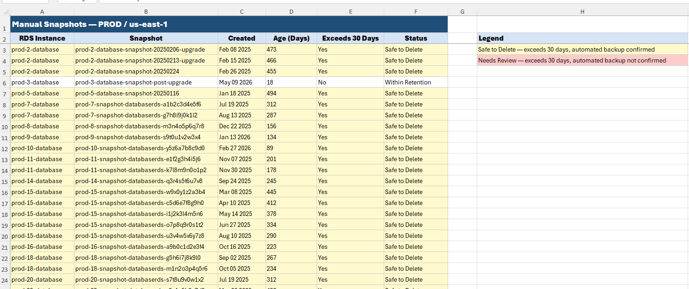
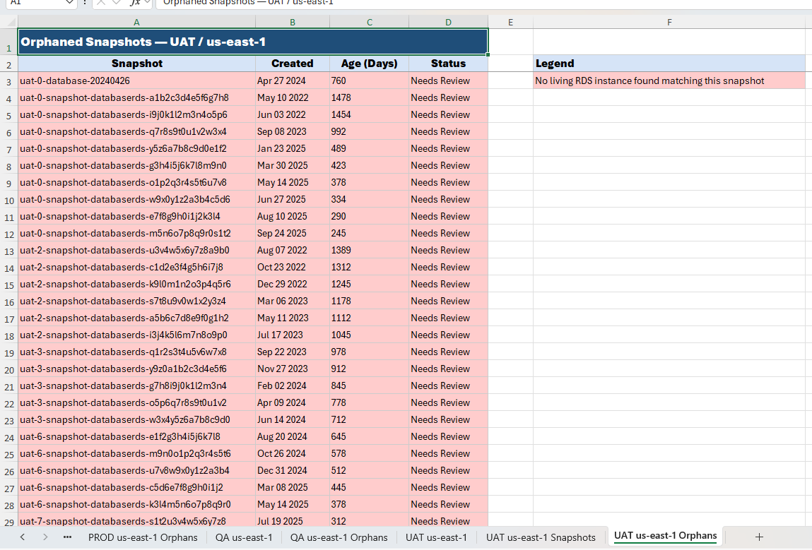

# RDS Audit Tool

Python utility for auditing AWS RDS environments across multiple accounts and regions. Produces a structured XLSX report tracking instance storage allocation, snapshot health, and estimated cost savings from right-sizing over-provisioned instances. Works entirely through read-only API calls using temporary credentials.



---

# Background & Goals

Several recurring concerns motivated this tool:

- RDS instances were provisioned with significantly more storage than was actually being used, with auto-scaling not configured to compensate
- Manual snapshots were accumulating without consistent retention policies, creating environment hygiene and cost concerns
- Orphaned snapshots from decommissioned instances were consuming space with no corresponding live instance
- No consolidated view existed across multiple environments and regions without access to Trusted Advisor or Cost Explorer

---

# What the Report Tracks

## RDS Instances


| Data Point | Why It Matters |
|---|---|
| Automated Backup Enabled | Determines whether manual snapshots are safe to remove |
| Allocated vs. Used vs. Free (GiB) | Identifies over-provisioned instances |
| Used % | Primary metric for right-sizing flagging |
| Excess (GiB) | Free storage being charged at full rate |

Instances are flagged based on storage utilization. Flagging applies only to instances with 50 GiB or more allocated, as smaller instances represent minimal cost impact:
- **Orange** - 25% or less of allocated storage in use (strong right-sizing candidate)
- **Yellow** - between 25% and 50% of allocated storage in use (monitor)
- **Purple** - suspected stale instance (name does not match standard `env-XX-database` pattern, read replicas excluded)
- **Red** - automated backup disabled

## Manual Snapshots



| Data Point | Why It Matters |
|---|---|
| Age (Days) | Identifies snapshots exceeding the 30-day retention policy |
| Exceeds 30 Days | Flags snapshots beyond the agreed retention window |
| Status | Safe to Delete / Needs Review / Within Retention |

Snapshot status logic:
- **Safe to Delete** - exceeds 30 days AND automated backup is confirmed on the matched instance
- **Needs Review** - exceeds 30 days but automated backup cannot be confirmed
- **Within Retention** - under 30 days, no action needed

## Orphaned Snapshots



Snapshots where no living RDS instance can be matched by environment prefix (e.g. `prod-XX-`, `qa-XX-`, `uat-XX-`). These are typically artifacts from decommissioned instances. All orphaned snapshots are flagged for review regardless of age.

## Right-Sizing Savings Estimate

Based on 30-day CloudWatch `FreeStorageSpace` averages. Two scenarios are provided:

| Scenario | Threshold | Description |
|---|---|---|
| Conservative | <= 25% utilized | Instances using 25% or less of allocated storage - clearest offenders |
| Moderate | <= 50% utilized | Broader set of candidates still representing clear over-provisioning |

Estimated annual savings are calculated by projecting each flagged instance down to its threshold utilization target, then applying the gp3 storage rate. The rate input cell on the Summary tab is pre-populated with the current AWS published gp3 price and can be updated at any time. Savings figures are estimates based on storage allocation only and do not account for other instance costs.

---

# Features

- Audits all enabled AWS regions across multiple accounts (Prod, QA, and UAT treated as separate AWS accounts) in a single run
- Skips regions with no RDS instances automatically
- Queries CloudWatch for 30-day average free storage per instance
- Matches snapshots to living instances using environment prefix patterns
- Identifies orphaned snapshots with no living instance
- Flags suspected stale instances based on non-standard naming conventions
- Produces both a raw JSON output and a formatted XLSX report
- XLSX tabs: Summary, per-region instance data, per-region manual snapshots, per-region orphaned snapshots
- Read-only - makes no changes to any AWS resources
- Credentials are used only during runtime and never written to disk

---

# Requirements

## Python

Python 3.10+

## Python Packages

```bash
pip install boto3 openpyxl
```

## AWS Permissions

The following permissions are required for each environment:

```text
sts:GetCallerIdentity
rds:DescribeDBInstances
rds:DescribeDBSnapshots
cloudwatch:GetMetricStatistics
ec2:DescribeRegions
```

## AWS Credentials

Temporary credentials are required for each environment separately. Prod, QA, and UAT each exist as separate AWS accounts with their own access keys. Credentials are pasted interactively at runtime and are never stored.

---

# Running the Script

```bash
python rds_audit.py
```

---

# Authentication Workflow

The script prompts for credentials for each environment upfront before any audit work begins. All three credential sets are collected first, then the full audit runs unattended.

Paste the AWS export block for each environment when prompted:

```bash
export AWS_ACCESS_KEY_ID="YOUR_ACCESS_KEY"
export AWS_SECRET_ACCESS_KEY="YOUR_SECRET_KEY"
export AWS_SESSION_TOKEN="YOUR_SESSION_TOKEN"
```

Credentials are:
- Used only during runtime
- Never written to disk
- Never embedded in output files

---

# Output

Two files are produced in the working directory upon completion:

| File | Description |
|---|---|
| `rds_audit_YYYYMMDD_HHMMSS.json` | Raw audit data for all environments and regions |
| `rds_audit_YYYYMMDD_HHMMSS.xlsx` | Formatted report for review and distribution |

If a custom filename is provided at the prompt, both files use that base name.

## XLSX Tab Structure

| Tab | Contents |
|---|---|
| Summary | Global findings, instance counts, storage totals, savings estimates |
| `ENV region` | RDS instance data for that environment and region |
| `ENV region Snapshots` | Manual snapshots with age and status |
| `ENV region Orphans` | Orphaned snapshots with no matching living instance |

---

# Expected Runtime

Runtime varies depending on the number of instances and regions. CloudWatch is queried once per instance for the 30-day average free storage metric. Regions with no RDS instances are skipped automatically. Unresponsive regions time out after 10 seconds and are skipped with a warning.

A full three-environment run across all enabled regions typically takes several minutes.

---

# Security Notes

This tool:
- Does not save AWS credentials
- Does not modify any AWS resources
- Does not delete any snapshots or instances
- Operates entirely read-only against AWS APIs
- Produces output files locally only

---

# License

MIT License. See [LICENSE](LICENSE) for details.